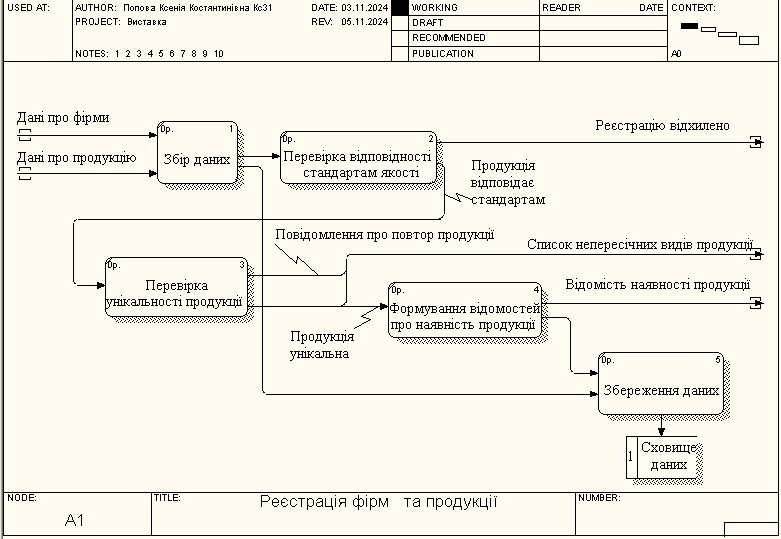
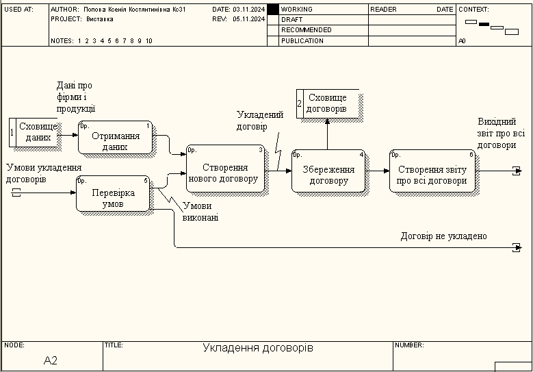
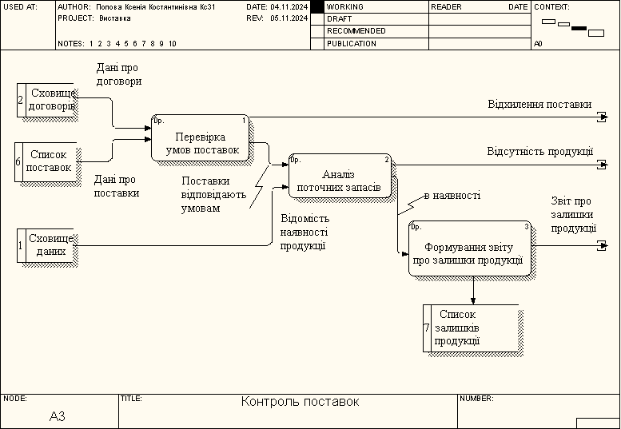
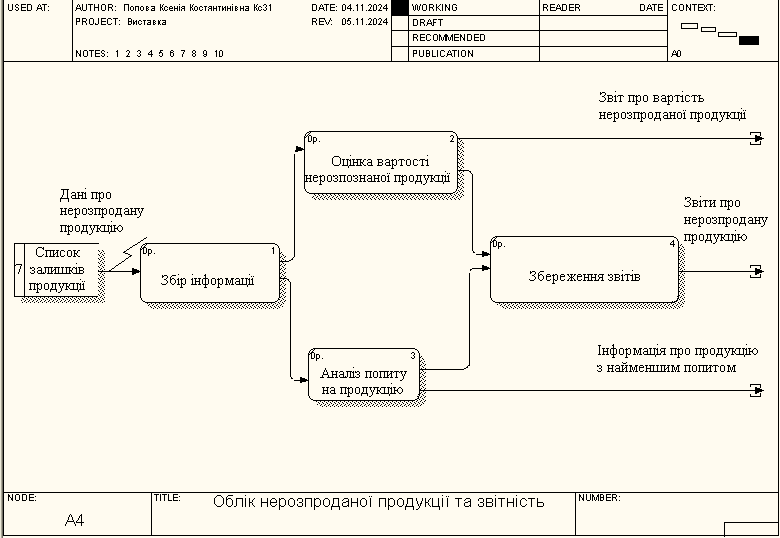
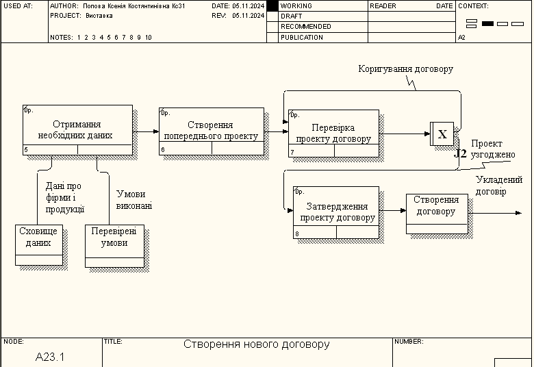

# Практична робота 4
---
Короткий опис
---
Ця робота присвячена моделюванню бізнес-процесів, пов’язаних із укладенням договорів, реєстрацією продукції та контролем поставок. Використовуючи методології DFD і IDEF3, були створені візуалізації ключових етапів взаємодії між учасниками, починаючи з збору даних про фірми та їхню продукцію і закінчуючи виконанням умов договорів. Модель дозволяє автоматизувати контроль за виконанням угод, оптимізувати управління запасами та підвищити ефективність бізнес-процесів.

